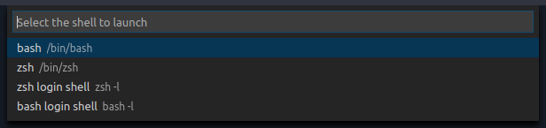

# Shell Launcher

Easily launch multiple shell configurations in the terminal.



## Commands

This extension exposes the following commands that can be keybound in your [keybindings.json](https://code.visualstudio.com/docs/customization/keybindings#_customizing-shortcuts) file:

- `shellLauncher.launch`: Display a quick pick that allows selecting of one of the configured terminal shells.

## Configuration
Do the following to bind the Shell Launcher command to CTRL+SHIFT+T.

1\. Open VS Code and hit CTRL+SHIFT+T, that will open keybindings.json. You can choose another key combination if you have already assigned CTRL+SHIFT+T to another command.

2\. Enter the following code to they keybindings.json file.

```javascript
[{
    "key": "ctrl+shift+t",
    "command": "shellLauncher.launch"
}]
```

3\. Save keybindings.json, hit CTRL+SHIFT+T and the Shell Launcher will open.

## Settings

All shells can be user configured in your [settings.json](https://code.visualstudio.com/docs/customization/userandworkspace) file, there is a different key for each platform:

- `shellLauncher.shells.linux`: For Linux
- `shellLauncher.shells.osx`: For macOS
- `shellLauncher.shells.windows`: For Window

When creating a shell configuration, the path to the executable must be defined. Other values are optional and will cause changes in the way the UI elements are presented. 

- shell: Path to the executable that launches the shell
- args: (Optional) An array of arguments to be passed to the shell on startup
- label: (Optional) Displayed in the shellLauncher dropdown menu
- launchNamed: (Optional) Displayed in the terminal dropdown menu

Here is an example shell which will launch `bash` as a login shell (`bash -l`) on Linux:

```json
{
  "shellLauncher.shells.linux": [
    {
      "shell": "bash",
      "args": ["-l"],
      "label": "bash login shell"
    }
  ]
}
```
